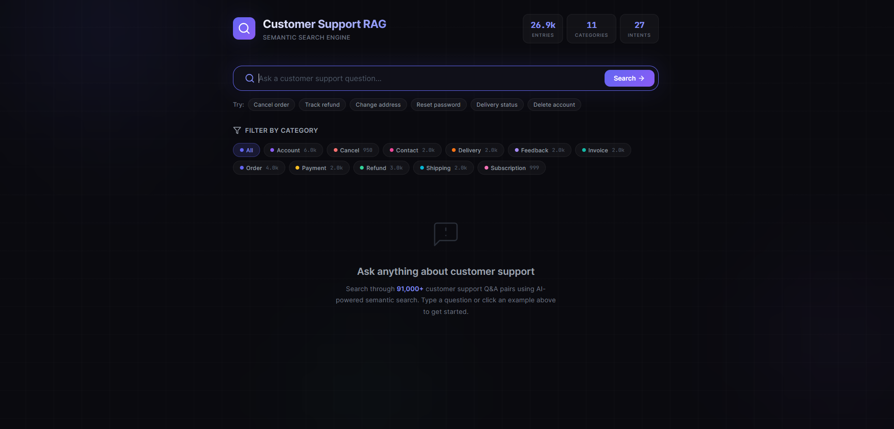
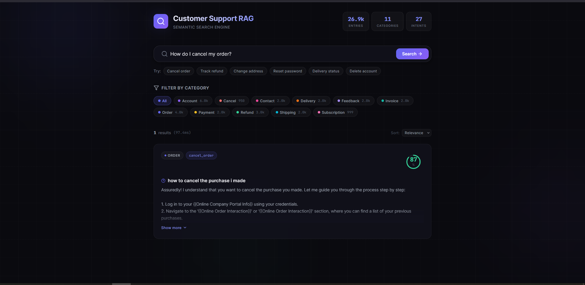

# 🎯 Customer Support RAG + Power BI

<div align="center">

### AI-Powered Customer Support with Real-Time Analytics Dashboard

Build an intelligent customer support assistant using **Retrieval-Augmented Generation (RAG)** and **LangGraph**, combined with **Power BI dashboards** for real-time analytics and performance monitoring.


</div>

---

## 📖 Overview

This project is an **AI-powered Customer Support Assistant** built using **Retrieval-Augmented Generation (RAG)** and **LangGraph agentic workflow**.

Instead of relying only on the LLM's memory, the system retrieves relevant information from your private knowledge base before generating responses, ensuring:

- ✅ Accurate answers with minimal hallucinations
- ✅ Context-aware customer support with multi-turn memory
- ✅ Fast semantic search using vector databases
- ✅ Real-time analytics through Power BI
- ✅ Easy integration with CSV files or APIs

> **Why RAG?**
>
> RAG combines the reasoning capabilities of Large Language Models with the reliability of your own data, giving you factual and trustworthy responses.

---

# ✨ Features

| Feature                | Description                                            | Status |
| ---------------------- | ------------------------------------------------------ | ------ |
| 🤖 AI Chatbot          | Context-aware responses powered by LangGraph & Llama-3 | ✅     |
| 🔍 Smart Retrieval     | Semantic search using FAISS / ChromaDB                 | ✅     |
| ⚡ Embedding Cache     | Pre-computed vectors for fast startup (< 0.2 seconds)  | ✅     |
| 💻 Web Interface       | Clean and responsive chat UI (Port 8000)               | ✅     |
| 📊 Power BI Dashboard  | Real-time analytics & KPIs                             | ✅     |
| 🔄 Auto Preprocessing  | Data cleaning and intelligent deduplication            | ✅     |
| 🔀 Intelligent Handoff | Automatic routing and transfer_to_human flag routing   | ✅     |

---

# 🏗️ Architecture

```text
┌─────────────────┐
│ Data Sources    │
│ (CSV, APIs...)  │
└────────┬────────┘
         │
         ▼
┌─────────────────┐
│ Preprocessing   │
│ Clean + Chunk   │
└────────┬────────┘
         │
         ▼
┌─────────────────┐
│ Vector Storage  │
│ FAISS / Chroma  │
└────────┬────────┘
         │
         ▼
┌─────────────────┐
│ Retrieval       │
│ Top-K Search    │
└────────┬────────┘
         │
         ▼
┌─────────────────┐
│ LangGraph Agent │
│ Llama-3 (Groq)  │
└────────┬────────┘
         │
   ┌─────┴─────┐
   ▼           ▼
Web Chat    Power BI
Interface   Dashboard
```

---

# 📂 Project Structure

```text
Customer-Support-RAG-PowerBI/

├── agent_brain/
│   ├── __init__.py
│   └── graph.py

├── customer_support_data/
│   └── data_preprocessing.ipynb

├── Data/
│   └── customer_support_data.csv

├── Data_Preprocessing/
│   ├── pipeline.py
│   └── preprocess.py

├── embeddings_cache/
│   ├── embeddings.npy
│   ├── faiss.index
│   └── meta.json

├── frontend/
│   ├── public/
│   └── src/

├── Llama/
│   └── LLama.py

├── static/
│   ├── app.js
│   ├── index.html
│   └── styles.css

├── vector_store/
│   ├── build_chroma.py
│   └── test_retrieval.py

├── .env
├── app.py
├── desktop_app.py
├── main_ui.py
├── requirements.txt
└── retriever.py

├── .gitignore

└── README.md
```

---

# 🚀 Quick Start

## 1️⃣ Clone Repository

```bash
git clone https://github.com/yourusername/Customer-Support-RAG-PowerBI.git

cd Customer-Support-RAG-PowerBI
```

---

## 2️⃣ Create Virtual Environment

```bash
python -m venv venv

# Windows
venv\Scripts\activate

# Linux / Mac
source venv/bin/activate
```

---

## 3️⃣ Install Dependencies

```bash
pip install -r requirements.txt
```

---

## 4️⃣ Configure Environment

Create a `.env` file:

```env
GROQ_API_KEY=your_groq_api_key_here

EMBEDDING_MODEL=sentence-transformers/all-mpnet-base-v2

LLM_MODEL=llama3-8b-8192

TOP_K_RETRIEVAL=5
```

---

## 5️⃣ Prepare Data

Place your CSV file inside:

```text
Data/customer_support_data.csv
```

Then run:

```bash
python Data_Preprocessing/pipeline.py

python vector_store/build_chroma.py
```

---

## 6️⃣ Launch Application

```bash
python app.py
```

Open:

```text
http://localhost:8000
```

---

# 💬 Usage

### Start Chat Server

```bash
python app.py
```

Navigate to:

```text
http://localhost:8000
```

Start chatting with your AI customer support assistant.

---

### Test Retrieval

```bash
python retriever.py
```

Single query:

```bash
python retriever.py \
--query "How do I reset my password?"
```

---

# 📊 Power BI Dashboard

1. Open Power BI Desktop
2. Click **Get Data**
3. Select **CSV** or **Web API**
4. Connect to your exported data
5. Load:

```text
dashboard/customer_support.pbix
```

Monitor:

- Customer satisfaction
- Average response time
- Ticket categories
- Most common issues
- Agent performance

---

# 📡 API Reference

| Method | Endpoint      | Description       |
| ------ | ------------- | ----------------- |
| GET    | `/`           | Chat UI           |
| POST   | `/api/chat`   | Ask Question      |
| POST   | `/api/search` | Semantic Search   |
| GET    | `/api/stats`  | Analytics Metrics |

### Example Request

```bash
curl -X POST http://localhost:8000/api/chat \
-H "Content-Type: application/json" \
-d '{
  "query":"How do I track my order?",
  "thread_id":"session_123"
}'
```

### Example Response

```json
{
  "query": "How do I track my order?",
  "response": "You can track your order from the Orders section.",
  "transfer_to_human": false,
  "thread_id": "session_123"
}
```

---

# ⚙️ Configuration

| Parameter       | Default           |
| --------------- | ----------------- |
| TOP_K           | 5                 |
| TEMPERATURE     | 0.3               |
| LLM_CORE        | Groq Llama-3      |
| EMBEDDING_MODEL | all-mpnet-base-v2 |

---

# 🛠️ Development

### Rebuild Knowledge Base

```bash
rm -rf embeddings_cache/*

python Data_Preprocessing/pipeline.py

python vector_store/build_chroma.py
```

---

# 🗺️ Roadmap

- ✅ Core RAG Pipeline
- ✅ Web Chat Interface
- ✅ Power BI Integration
- ✅ FAISS Support
- ✅ ChromaDB Support
- ✅ Conversation Memory (LangGraph Checkpointers)
- ✅ Human Agent Handoff Routing
- ⏳ Multi-language Support
- ⏳ Conversation Memory
- ⏳ User Feedback Loop
- ⏳ Teams & Slack Integration
- ⏳ Fine-Tuned Domain Model

---

# 🧰 Tech Stack

| Layer           | Technology                                |
| --------------- | ----------------------------------------- |
| Vector Database | FAISS · ChromaDB                          |
| Embeddings      | Sentence-Transformers (all-mpnet-base-v2) |
| LLM             | Groq Llama-3 (Llama-3-8b-Instant)         |
| Backend         | FastAPI                                   |
| Frontend        | React.js (Vite) · Tailwind CSS            |
| Analytics       | Microsoft Power BI                        |
| Data Processing | Pandas · NumPy                            |

---

# 🤝 Contributing

1. Fork the repository
2. Create a branch

```bash
git checkout -b feature/amazing-feature
```

3. Commit changes

```bash
git commit -m "Add amazing feature"
```

4. Push changes

```bash
git push origin feature/amazing-feature
```

5. Open a Pull Request

# 🏗️ Architecture

<p align="center">
  
</p>

---

# 💬 Usage

### Web Chat Interface

<p align="center">
  
</p>

---

<p align="center">
  <a href="videos/demo.mp4">
    🎬 Click to Watch Demo
  </a>
</p>
---

# 📄 License

Distributed under the **MIT License**.

See the `LICENSE` file for more information.

---

<div align="center">

### ⭐ If you like this project, give it a star!

Built with ❤️ to create better customer experiences.
